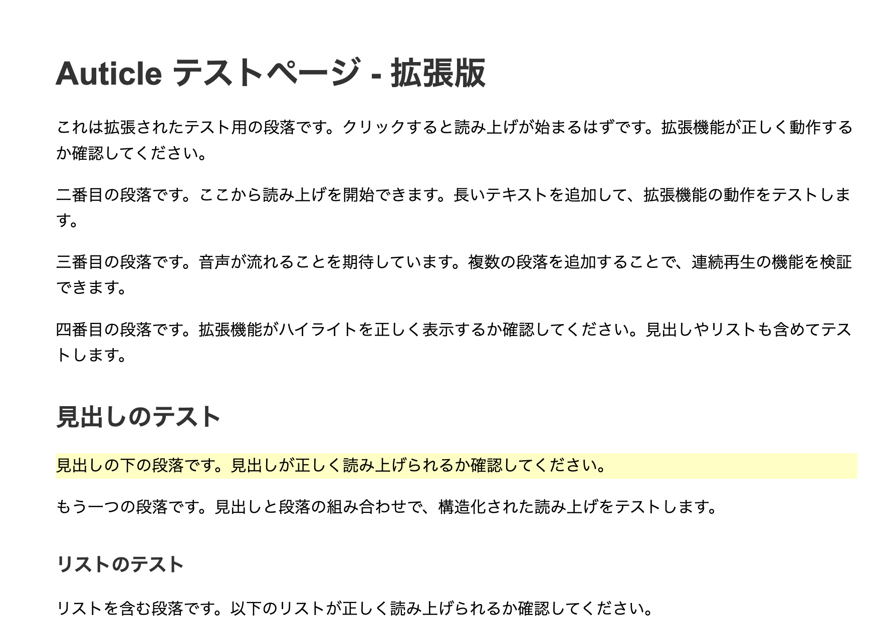

# Audicle

[](https://opensource.org/licenses/MIT)
[](packages/chrome-extension)
[](packages/web-app)

Audicle（Article + Audio）は、ウェブページ上の記事コンテンツを音声で読み上げるプラットフォームです。

クリックした段落から、記事の最後までをインテリジェントに読み上げ、再生箇所をハイライトすることで、快適な「ながら読書」体験を提供します。



> 💡 **デモ動画を作成したい方へ**: [デモ動画作成ガイド](docs/DEMO_VIDEO_GUIDE.md) を参照してください。

---

## 📑 目次

- [概要](#-概要)
- [主な機能](#-主な機能)
- [プロジェクト構造](#-プロジェクト構造)
- [クイックスタート](#-クイックスタート)
- [設定](#%EF%B8%8F-設定)
- [テスト](#-テスト)
- [開発](#-開発)
- [詳細ドキュメント](#-詳細ドキュメント)
- [注意事項](#-注意事項)
- [よくある質問（FAQ）](#-よくある質問faq)
- [サポート・コミュニティ](#-サポートコミュニティ)
- [貢献](#-貢献)
- [ライセンス](#-ライセンス)

---

## 📖 概要

Audicle は、Web ブラウジング中に記事を「読む」のではなく「聴く」ことを可能にするプラットフォームです。

**こんな方におすすめ:**
- 家事や運動をしながら情報収集したい方
- 長時間の画面注視による眼精疲労を軽減したい方
- 通勤・通学中にニュース記事やブログを楽しみたい方
- 読書バリアフリーを求める方

**特徴:**
- Chrome 拡張機能と Web アプリケーションの両方で利用可能
- モノレポ構成で、拡張機能・API サーバー・Web UI を一元管理
- 複数の音声合成エンジン（Google TTS、Edge TTS など）に対応
- オープンソースで自由にカスタマイズ可能

## ✨ 主な機能

- **ワンクリック再生**: 記事の読みたい段落をクリックするだけで、そこから再生が開始されます
- **インテリジェントな本文抽出**: Mozilla Readability.js を活用し、広告やサイドバーなどの不要な要素を除去
- **構造を意識した読み上げ**: 見出しや箇条書きを認識し、自然な読み上げを実現
- **連続再生 & プリフェッチ**: 記事の最後まで音声を自動で連続再生
- **同期ハイライト**: 現在再生中の段落がリアルタイムでハイライト
- **複数 TTS エンジン対応**: Google TTS、Edge TTS、API サーバーなどから選択可能
- **Web UI**: Next.js ベースのモダンな Web アプリケーション
- **記事管理**: 保存した記事の一覧表示と管理機能
- **音声キャッシュ**: 高速な再生のためのキャッシュ機能

## 📂 プロジェクト構造

本プロジェクトはモノレポ構成を採用しています：

```
/
├── packages/
│   ├── chrome-extension/     # Chrome 拡張機能本体
│   ├── api-server/           # FastAPI ベースの TTS API サーバー
│   ├── web-app/              # Next.js ベースの Web UI アプリケーション
│   ├── google-tts-server/    # Google Cloud TTS 専用サーバー (_archive/)
│   ├── python-tts-server/    # Python Edge TTS サーバー (_archive/)
│   └── docker-tts-server/    # Docker 版 Edge TTS サーバー (_archive/)
├── .gitignore
├── LICENSE                   # MIT License
├── README.md
└── BRANCH_REPORT.md          # 最新開発レポート
```

## 🚀 クイックスタート

### 前提条件

- **Node.js** 18 以上（Web アプリケーション用）
- **Docker** & **Docker Compose**（API サーバー用）
- **Google Chrome** または **Chromium ベースブラウザ**（拡張機能用）

### 1. API サーバーの起動（オプション）

API サーバーは、高品質な音声合成と 2 倍速再生を提供します。Google TTS のみを使用する場合は、このステップをスキップできます。

```bash
cd packages/api-server
docker-compose up -d
```

**確認方法:**
```bash
curl http://localhost:8000/
# {"message": "Audicle TTS API Server is running"} が返ればOK
```

### 2. 利用方法の選択

#### オプション A: Chrome 拡張機能を使用

1. Chrome で `chrome://extensions/` を開く
2. 「デベロッパーモード」を有効にする
3. 「パッケージ化されていない拡張機能を読み込む」をクリック
4. `packages/chrome-extension/` ディレクトリを選択

#### オプション B: Web アプリケーションを使用

```bash
cd packages/web-app
npm install
npm run dev
```

ブラウザで [http://localhost:3000](http://localhost:3000) を開いて使用開始

### 3. 使用開始

#### Chrome 拡張機能の場合:

1. 記事ページを開く（例: Wikipedia, Qiita, ブログ記事）
2. Audicle アイコンをクリックし、「読み上げモード」を ON
3. 読みたい段落をクリックすると音声再生が開始されます

#### Web アプリケーションの場合:

1. [http://localhost:3000](http://localhost:3000) にアクセス
2. 「+ 新しい記事を読む」ボタンをクリック
3. 記事 URL を入力して「読込」
4. 再生ボタンをクリックして音声読み上げを開始

## ⚙️ 設定

### Chrome 拡張機能設定

`packages/chrome-extension/config.json` で TTS エンジンを設定：

```json
{
  "synthesizerType": "google_tts" // または "api_server", "edge_tts" など
}
```

### Web アプリケーション設定

`packages/web-app/.env.local` で API サーバーの URL を設定：

```bash
NEXT_PUBLIC_API_URL=http://localhost:8000
```

### 利用可能な TTS エンジン

- `google_tts`: Google 翻訳 TTS（デフォルト）
- `api_server`: 自前 API サーバー（高品質、2 倍速対応）
- `edge_tts`: Microsoft Edge TTS
- `edge_tts_docker`: Docker 版 Edge TTS

## 🧪 テスト

### Chrome 拡張機能テスト

```bash
# 拡張機能のテストページを開く
open packages/chrome-extension/test/test.html
```

### Web アプリケーションのテスト

```bash
# Web App のテスト実行
cd packages/web-app
npm run dev

# ブラウザで http://localhost:3000 にアクセスしてテスト
```

### API サーバーテスト

```bash
# サーバー起動確認
curl http://localhost:8000/

# 音声合成テスト
curl -X POST http://localhost:8000/synthesize \
  -H "Content-Type: application/json" \
  -d '{"text": "こんにちは", "voice": "ja-JP-NanamiNeural"}' \
  --output test.mp3

# 本文抽出テスト
curl -X POST http://localhost:8000/extract \
  -H "Content-Type: application/json" \
  -d '{"url": "https://example.com/article"}'
```

## 🔧 開発

### Dev Container での開発（推奨）

このプロジェクトは VS Code Dev Containers をサポートしています。一貫した開発環境を簡単に構築できます。

#### Dev Container の使用方法

1. **VS Code をインストール**
2. **Dev Containers 拡張機能をインストール**
3. **プロジェクトを開く**: `File > Open Folder` でプロジェクトルートを選択
4. **コンテナを開く**: コマンドパレット (`Ctrl+Shift+P`) で "Dev Containers: Reopen in Container" を実行
5. **環境構築完了**: 自動的に必要なツールと拡張機能がインストールされます

Dev Container には以下のツールが含まれています：

- Node.js & npm (Chrome 拡張機能 & Web App 開発用)
- Python & pip (API サーバー開発用)
- Docker & Docker Compose (コンテナ化されたサービス用)
- Git & GitHub CLI
- 各種 VS Code 拡張機能（Python, Docker, Chrome Debug など）

#### ポートフォワーディング

Dev Container では以下のポートが自動的にフォワードされます：

- `3000`: Web App (Next.js)
- `8000`: API Server
- `8001`: Google TTS Server
- `8002`: Python TTS Server

### ローカル環境構築（手動）

Dev Container を使用しない場合は、手動で環境を構築してください：

```bash
# Node.js 依存関係（Chrome 拡張機能 & Web App 用）
cd packages/chrome-extension
npm install

cd ../web-app
npm install

# Python 依存関係（API サーバー用）
cd ../api-server
pip install -r requirements.txt
```

### 新しい TTS エンジンの追加

1. `packages/chrome-extension/background.js` の `SynthesizerFactory` に新しいクラスを追加
2. `AUDIO_SYNTHESIS_MODULES.md` を更新
3. `config.json` で設定可能に

### 新しいサイト対応ルールの追加

`packages/chrome-extension/content-extract/rules.js` を編集：

```javascript
SITE_SPECIFIC_RULES = {
  "example.com": {
    id: "example-custom",
    priority: 1000,
    contentSelector: "article p, .content p",
    description: "example.com 用カスタム抽出ルール",
  },
};
```

## 📖 詳細ドキュメント

### プロジェクト全体

- **[貢献ガイド](CONTRIBUTING.md)** - 開発に参加する方法
- **[デモ動画作成ガイド](docs/DEMO_VIDEO_GUIDE.md)** - デモ動画を作成する方法
- **[ライセンス](LICENSE)** - MIT License

### Web アプリケーション

- [Web App README](packages/web-app/README.md)
- [開発ブランチレポート](BRANCH_REPORT.md)
- [実装完了レポート](packages/web-app/COMPLETION_REPORT.md)

### Chrome 拡張機能

- [Chrome 拡張機能詳細](packages/chrome-extension/README.md)
- [音声合成モジュール](packages/chrome-extension/AUDIO_SYNTHESIS_MODULES.md)
- [サイト対応ルール追加ガイド](packages/chrome-extension/content-extract/RULE_ADDITION_GUIDE.md)

### API サーバー

- [API サーバー仕様](packages/api-server/README.md)
- [API サーバー実装レポート](packages/completion-report.md)

## 📝 注意事項

- **対応言語**: 日本語と英語に最適化
- **利用制限**: Google TTS は非公式利用のため、大量リクエスト時はブロックされる可能性あり
- **プライバシー**: テキストが外部サーバーに送信されます
- **ブラウザ**: Google Chrome 向け（Chromium ベースブラウザでも動作可能）
- **Web App**: 最新の機能（2 倍速再生、キャッシュ、記事管理）は Web App で利用可能

## 🔍 よくある質問（FAQ）

### Q: 音声が再生されません

**A:** 以下を確認してください：
1. API サーバーが起動しているか（`curl http://localhost:8000/` で確認）
2. `config.json` の `synthesizerType` 設定が正しいか
3. Chrome 拡張機能がリロードされているか（`chrome://extensions/` でリロードボタンをクリック）
4. ブラウザのコンソールにエラーが表示されていないか

### Q: 一部のサイトで本文が正しく抽出されません

**A:** サイト固有のルールを追加することで改善できます：
1. `packages/chrome-extension/content-extract/rules.js` を開く
2. `SITE_SPECIFIC_RULES` に新しいルールを追加
3. 詳細は [Chrome 拡張機能 README](packages/chrome-extension/README.md) の「新サイト対応ルール追加手順」を参照

### Q: Google TTS が「429 Too Many Requests」エラーになります

**A:** Google TTS は非公式 API のため、大量リクエストでブロックされる可能性があります：
- API サーバー（Edge TTS）への切り替えを推奨します
- `config.json` で `"synthesizerType": "api_server"` に変更

### Q: 2 倍速再生を使いたい

**A:** 2 倍速再生は API サーバーまたは Web アプリで利用可能です：
- Chrome 拡張機能: `config.json` で `"synthesizerType": "api_server"` に設定
- Web アプリ: デフォルトで 2 倍速再生に対応

### Q: Dev Container で開発したい

**A:** VS Code の Dev Containers 拡張機能を使用してください：
1. VS Code で `Dev Containers: Reopen in Container` を実行
2. 自動的に開発環境が構築されます
3. 詳細は「🔧 開発」セクションを参照

## 💬 サポート・コミュニティ

質問や問題がある場合は、以下の方法でサポートを受けられます：

- **GitHub Issues**: [バグ報告や機能要望](https://github.com/is0692vs/Audicle/issues)
- **GitHub Discussions**: 一般的な質問や議論（準備中）
- **ドキュメント**: [詳細ドキュメント](#-詳細ドキュメント) を参照

## 🤝 貢献

Audicle へのコントリビューションを歓迎します！

### クイックスタート

1. リポジトリをフォーク
2. 機能ブランチを作成 (`git checkout -b feature/amazing-feature`)
3. 変更をコミット (`git commit -m 'feat: Add amazing feature'`)
4. ブランチにプッシュ (`git push origin feature/amazing-feature`)
5. Pull Request を作成

### 詳細なガイドライン

貢献方法の詳細については、[CONTRIBUTING.md](CONTRIBUTING.md) をご覧ください：

- バグ報告・機能要望の方法
- 開発環境のセットアップ
- コーディング規約
- コミットメッセージ規約
- プルリクエストのテンプレート

## 📄 ライセンス

MIT License - [LICENSE](LICENSE) を参照
